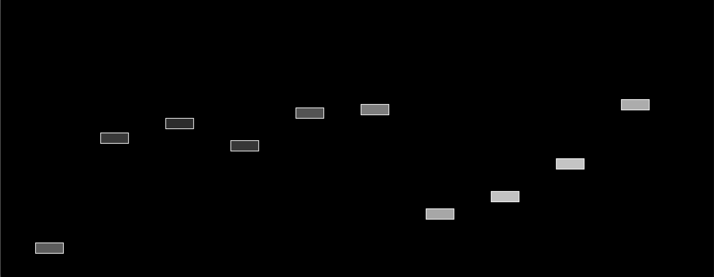

# TIL
The art installation «til» consists of multiple light elements, which are called «luboids». The layout of the elements represents the structure of a project timeline, whereas every «luboid» reflects a single task. Each task lights up from time to time to express the work behind it. When a visitor enters the office, a wave of light moves through the fictional project plan and displays the influence the visitor will have on the work of the company.




### Develop

```bash
platformio init --ide clion --board esp32doit-devkit-v1
```

### Motherboard Schema

